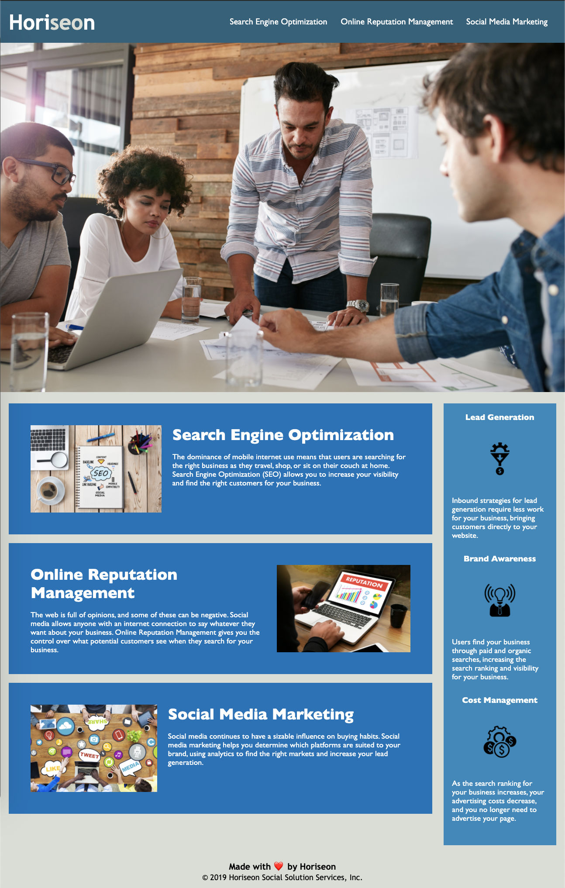

# HTML CSS Git Challenge
Responsive HTML/CSS for a sample marketing website.

## Repo Organization
Static files are in the `assets` directory and HTML is in `index.html`.

## User Story
AS A marketing agency
I WANT a codebase that follows accessibility standards
SO THAT our own site is optimized for search engines

## Questions
If you have any questions, email me at [vlane0593@gmail.com](mailto:vlane0593@gmail.com) or reach out on [GitHub](https://www.github.com/vanessalane).

## Screenshot

